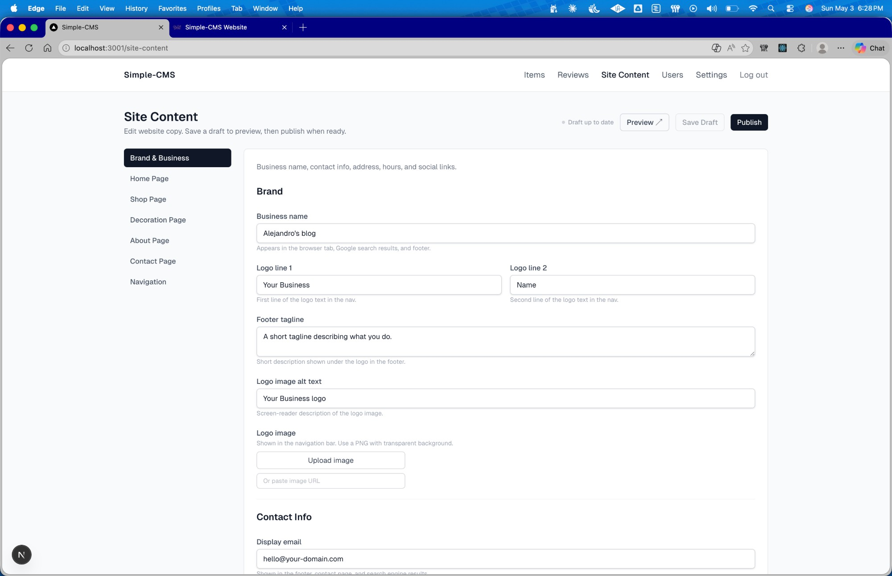
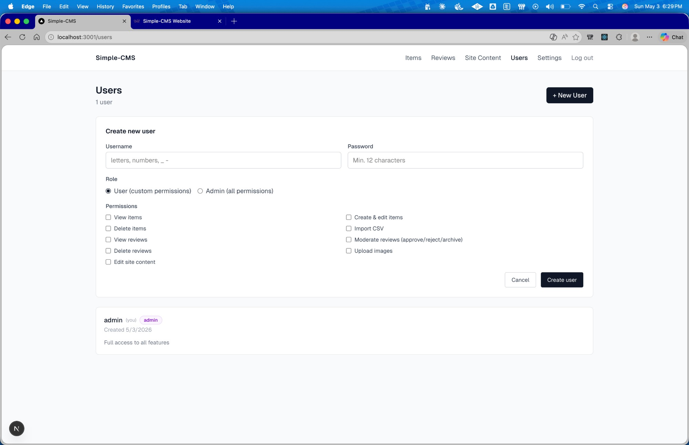

# Simple-CMS

A self-hostable, full-stack CMS template for any website or project.

---

## Features

- **Items CRUD** — create, edit, delete items with images, status tracking, and publish workflow
- **Bulk CSV import** — import items in bulk from a CSV file
- **Image uploads** — JPEG/PNG/WebP/GIF/HEIC/HEIF supported; auto-compressed to 2000px JPEG 85% before upload to S3
- **Reviews moderation** — approve or reject user-submitted reviews
- **Site content editor** — edit all public-facing text (brand name, copy, contact info) without touching code
- **Multi-user with roles** — invite team members and assign granular permissions per user
- **Session auth** — HTTP-only session cookies, bcrypt passwords, optional TOTP 2FA
- **Monthly IAM key rotation** — GitHub Actions workflow rotates AWS credentials automatically on the 1st of each month
- **One-command deploys** — push to `main` and GitHub Actions builds and ships the API to Lightsail

---

## Screenshots

**Admin — Site Content editor**


**Public website — live after publish**


---

## Tech Stack

| Layer | Technology |
|-------|-----------|
| **Backend** | Go 1.25, chi router, SQLite (WAL mode) |
| **Admin UI** | Next.js 16, React 19, TypeScript, Tailwind CSS 4, SWR |
| **Public Website** | Next.js 16, React 19, TypeScript, Tailwind CSS 4, ISR |
| **Infra** | AWS Lightsail (Docker + Caddy), AWS S3, Vercel free tier |

---

## Architecture

```
Admin UI (Vercel)    Public Website (Vercel)
       |                     |
       | HTTPS               | HTTPS (ISR, revalidate webhook)
       v                     v
  Caddy (Lightsail)          AWS S3
       |                       ^
       | reverse proxy         | image uploads
       v                       |
   Go API (:8080) ------------>+
       |
       | reads/writes
       v
    SQLite (WAL)
```

- Caddy handles HTTPS termination and proxies all traffic to the Go API on port 8080
- The Go API talks directly to a local SQLite database and to S3 for image storage
- The Admin UI is a Next.js app deployed on Vercel — it calls the API over HTTPS
- The Public Website is a separate Next.js app on Vercel — server-side rendered with ISR (items revalidate every 60s, site content every 3600s, plus on-demand via webhook)

---

## Quick Start (local, no AWS needed)

See **[docs/QUICKSTART.md](docs/QUICKSTART.md)** — you can have the full stack (API + Admin UI + public website) running locally in about 5 minutes.

---

## Documentation

| Doc | Description |
|-----|-------------|
| [docs/QUICKSTART.md](docs/QUICKSTART.md) | 5-minute local setup — no AWS required |
| [docs/LOCAL_DEV.md](docs/LOCAL_DEV.md) | Full local development guide, env vars, smoke tests |
| [docs/AWS_SETUP.md](docs/AWS_SETUP.md) | Create S3 bucket, IAM user, Lightsail instance, Secrets Manager |
| [docs/DEPLOY_BACKEND.md](docs/DEPLOY_BACKEND.md) | Deploy the Go API to Lightsail with Docker + Caddy |
| [docs/DEPLOY_FRONTEND.md](docs/DEPLOY_FRONTEND.md) | Deploy the Admin UI and public website to Vercel |
| [docs/DNS_SETUP.md](docs/DNS_SETUP.md) | DNS records for your domain |
| [docs/CUSTOMIZATION.md](docs/CUSTOMIZATION.md) | Add fields, change categories, customize for your project |
| [docs/IAM_KEY_ROTATION.md](docs/IAM_KEY_ROTATION.md) | Automated monthly AWS IAM key rotation via GitHub Actions |

---

## Cost Breakdown

| Service | Cost |
|---------|------|
| AWS Lightsail ($7/mo plan) | ~$7.00 |
| AWS S3 (storage + requests) | ~$0.12 |
| AWS Secrets Manager | ~$0.40 |
| Vercel (free tier) | $0.00 |
| **Total** | **~$7–8/month** |

---

## Customize It

Simple-CMS is a template — fork it and make it yours. See **[docs/CUSTOMIZATION.md](docs/CUSTOMIZATION.md)** for how to:

- Add new fields to the Item model
- Change item categories and statuses
- Add new permissions
- Rename the Go module for your fork
- Extend the site content schema
